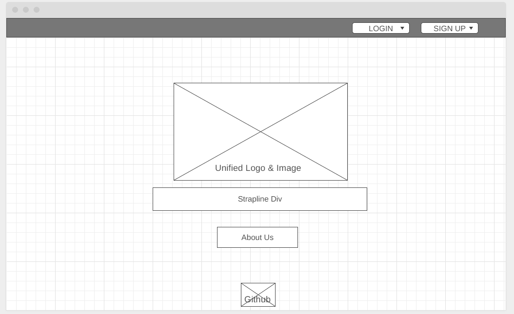
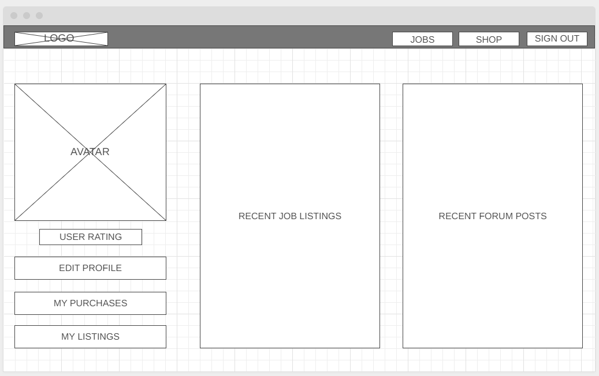
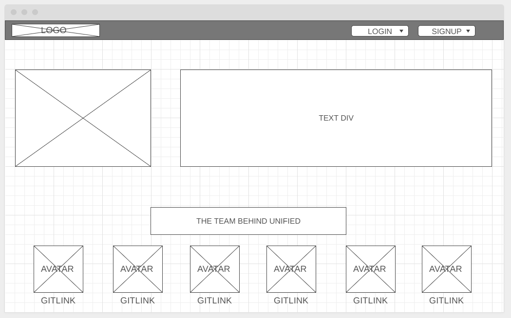
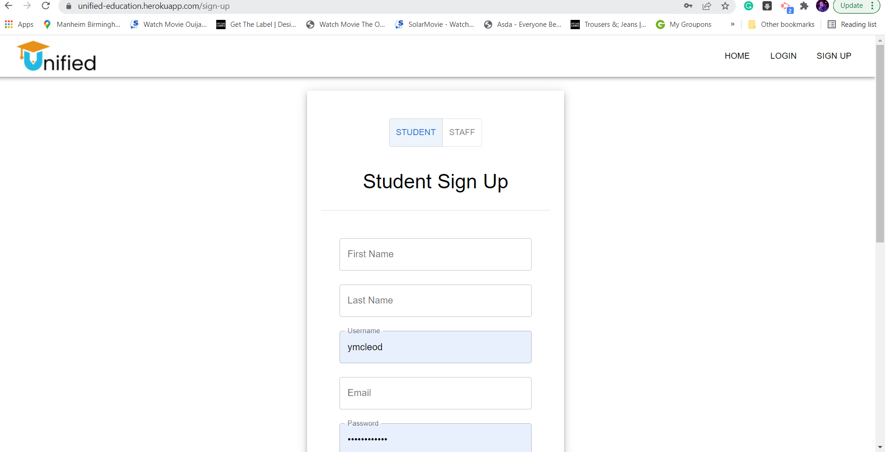
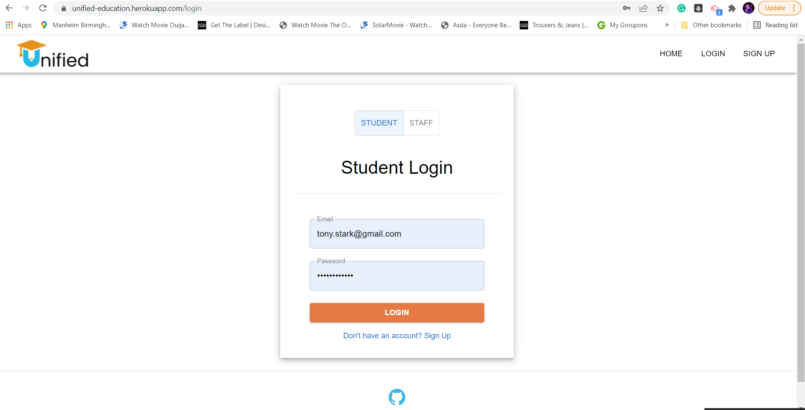
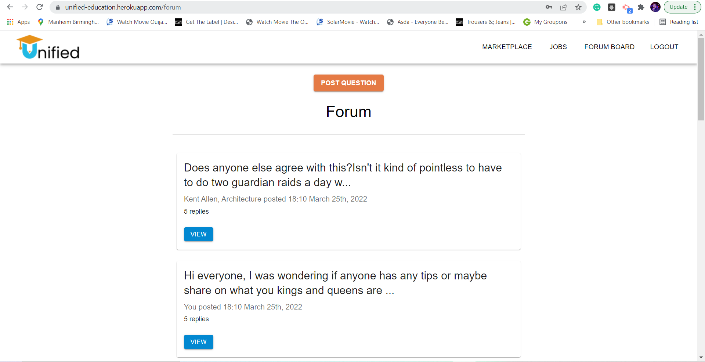
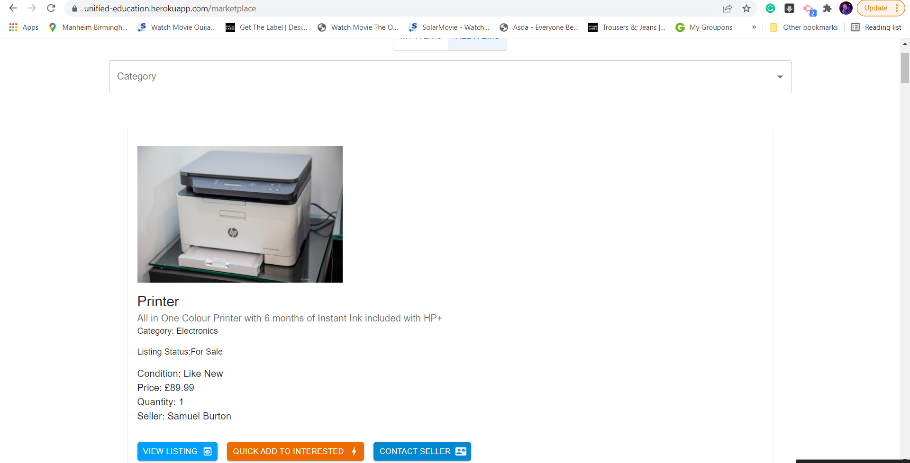

# UNIFIED

## Table Of Contents

- [UNIFIED](#unified)
  - [Table Of Contents](#table-of-contents)
  - [Project Link](#project-link)
  - [Contributors](#contributors)
  - [About The Project](#about-the-project)
  - [Tool & Technologies Used](#tool--technologies-used)
    - [Technical](#technical)
    - [Non Technical](#non-technical)
  - [User Flow](#user-flow)
- [Wireframes](#wireframes)
  - [User Journey](#user-journey)
    - [Buy/Sell Items](#buysell-items)
    - [Job Board](#job-board)
    - [Forum Board](#forum-board)
- [Screenshots](#screenshots)
  - [Logo-Unified](#logo-unified)
  - [Deployed app screenshots](#deployed-app-screenshots)
  - [Plans For Improvement](#plans-for-improvement)
  - [Deployed link to application](#deployed-link-to-application)

## Project Link

Click [here](https://github.com/conorjkelly96/unified-server) to view the project on Github pages.
_Sever Repo_

Click [here](https://github.com/conorjkelly96/unified-client) to view the project on Github pages. _Client Repo_

## Contributors

- [Kayle Rieger Patton](https://github.com/kayleriegerpatton)
- [Conor Kelly](https://github.com/conorjkelly96)
- [Liana Laurentiu](https://github.com/lianavaleria15)
- [Matt Palmer](https://github.com/tigerbath)
- [Yashemabeth Mcleod](https://github.com/Yashemabeth)
- [Sumaia Sorna](https://github.com/SumaiaSorna)

## About The Project

- One-stop-shop where students can find career development opportunities, engage with each other, and make environmentally and financially sustainable choices.
- Contemporary student values, modern presentation
- Organic, community driven social engagement
- Focus on sustainability
- Finances (loan-aversion, off-campus living)
- Skills development & career preparation
- Social media engagement
- Simple app, compact design

## Tool & Technologies Used

### Technical

- AWS
- React
- Apollo Client
- Material UI
- JavaScript
- GraphQL
- Apollo Server
- Mongoose & MongoDB
- JSONWebToken
- bcrypt
- Authentication Sensitive API key
- Date-fns .env
- Queries Mutations
- Heroku deployment

### Non Technical

- Asana
- Slack & Zoom
- GitHub

## User Flow

- Data Model

# Wireframes

## User Journey

### Buy/Sell Items

- As a user I should be able to upload university items to sell to students
- As a user I should be able to search for items on sale
- As a potential buyer of a product I should be able to post my questions
- As a user I should be able to purchase a product via a payment gateway
- As a user I should be able to view all my purchases
- As a seller I should be able to view all my posted items
- As a buyer I should be able to view my order status
- As a seller/buyer I should be able to update the order status upon collection of the item
- As a buyer I should be able to leave a rating for the seller
- As a seller I should be able to update my item to sell

### Job Board

- As a university staff member I should be able to create a new job advert
- As a student I should be able to view all job postings
- As a student I should be able to add a job to my saved jobs
- As a student I should be able to view all my saved jobs
- As a university staff member I should be able to update my job advert

### Forum Board

- As a student I should be able to post a question in the forum
- As a student I should be able to view all questions
- As a student I should be able to post a reply for a specific question
- As a student I should be able to react to one of the replies
- As a student I should be able to delete my reply
- As a student I should be able to delete my question
- As a student I should be able to edit my reply
- As a student I should be able to edit my question
- As a student I should be able to view my questions

# Screenshots

## Logo-Unified

## Deployed app screenshots

## Plans For Improvement

- Marketplace - “Borrow” feature , Online payment feature.
- UX/UI- Dashboard - edit user feature; edit/delete feature for marketplace & forum.
- Technicality - Reduce component duplicates.

## Deployed link to application

https://unified-education.herokuapp.com/
